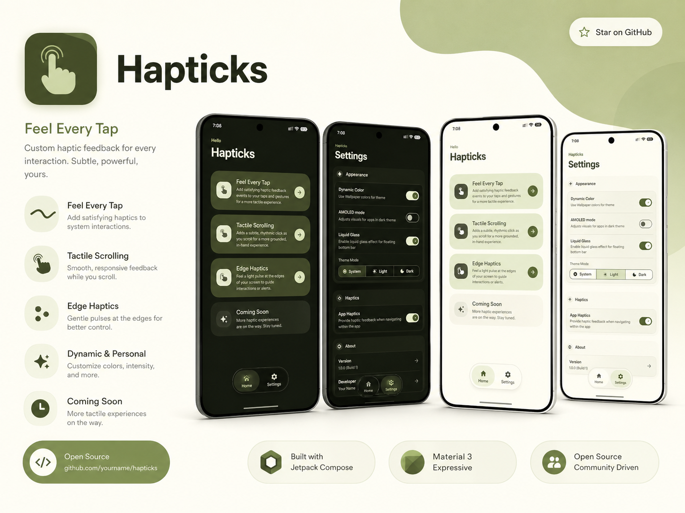

  

<h1 align="center">Hapticks</h1>

  <b>Feel Every Tap.</b> 
  Custom haptic feedback for every interaction. Subtle, powerful, yours.

  
  
  
  

---

## ✨ Why Hapticks?

I’m a big fan of haptic feedback. Some phones especially Pixel devices have really good haptics, but
they’re **underutilized**.

A lot of apps and even parts of Android don’t give haptic feedback when you interact with them. That
makes the experience feel flat.

**Hapticks fixes that.** It makes every interaction feel more alive, premium, and satisfying.

---

## 🚀 What It Does

* Adds rich haptic feedback to UI interactions across apps and system UI
* Improves the feel of scrolling, tapping, and touch actions
* Makes your phone feel more alive and satisfying

---

## 🎛️ Features

| Feature                        | Description                                                                                                             |
|--------------------------------|-------------------------------------------------------------------------------------------------------------------------|
| **Feel Every Tap**             | Responsive haptic feedback across buttons, toggles, switches, checkboxes, and more making every interaction feel alive. |
| **Tactile Scrolling**          | Subtle vibrations while scrolling for a smoother, more physical and immersive navigation experience.                    |
| **Edge Haptics**               | Distinct feedback when you reach the top or bottom of a scrollable view, so you always know when content ends.          |
| **15 Premium Haptic Patterns** | Custom haptic patterns that feel natural, refined, and satisfying.                                                      |
| **Liquid Glass Effect**        | iOS 26–inspired liquid glass bottom navigation for a sleek, modern look.                                                |
| **Material 3 Design**          | Built with the latest Material 3 expressive system for a clean, dynamic, and polished interface.                        |

---

## 📝 Notes

> ⚠️ **Work in Progress**
>
> The goal is to make haptics feel natural, fast, and consistent across all apps without adding lag
> or using too much battery.

---

  <i>Built with care for haptic lovers everywhere.</i>

