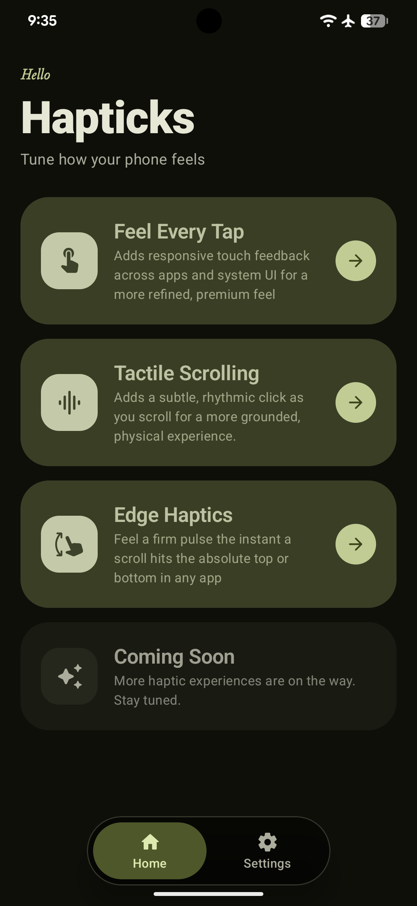
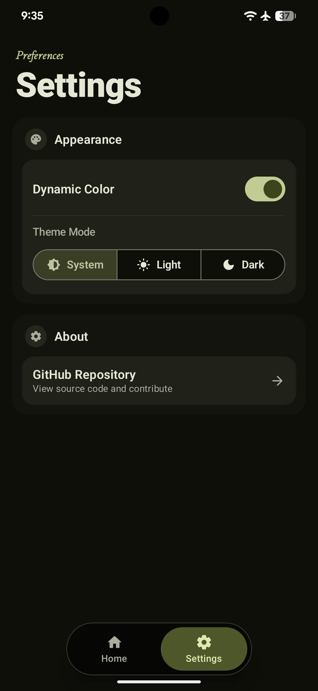

# Hapticks

Hapticks is an Android app + LSPosed module that adds haptic feedback across apps and system UI to make your phone feel more responsive and premium.

## Why I Built This

I’m a big fan of haptic feedback. Some phones—especially Pixel devices—have really good haptics, but they’re not used enough.

A lot of apps and even parts of Android don’t give feedback when you interact with them. That makes the experience feel a bit flat.

So I built Hapticks to fix that and make interactions feel more alive and satisfying.

## What It Does

* Adds haptic feedback to UI interactions
* Improves the feel of scrolling and touch actions
* Makes the overall experience more “premium”

## Requirements

* Accessibility permission (for app-level haptics)
* LSPosed (for system-wide features like edge haptics)

Right now, LSPosed is needed to make it work across the whole system. I’m still looking for a better solution in the future.

## Screenshots

```


```

## Notes

This is still a work in progress. The goal is to make haptics feel natural, fast, and consistent across all apps without adding lag or using too much battery.
